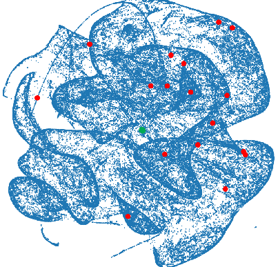
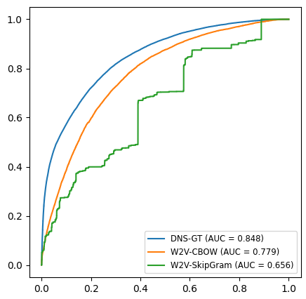

# DNS-GT

DNS-GT is a Transformer-based model that learns embeddings for domain names using DNS
queries.
---





## Requirements

Make sure to use the Python and TensorFlow versions specified at the top of this page.

### Install the required libraries:

```
python3 -m pip install -r requirements.txt
```

## Usage

### 1. Get the Code

Clone the repository containing the necessary code and scripts:
```
git clone https://github.com/m-altieri/DNS-GT.git
```

### 2. Get the Data

- Download the raw DNS traffic dataset (TI-2016) from
  https://ieee-dataport.org/documents/ti-2016-dns-dataset and save it in `<DATA_PATH>`.

It should contain 10 folders: Day0, Day1, Day2, Day3, Day4, Day5, Day6, Day7, Day8 and
Day9, for a total of 240 pcap files. The total size of the dataset should be around 113
GiB.

- Download the blacklists with:
```
bash src/scripts/download_blacklists.sh <DATA_PATH>
```
They will be downloaded from `https://firebog.net` and automatically organized in
different folders depending on their category (`advertising`, `malicious`, `other`,
`suspicious` and `tracking`) and quality (`good` and `ok`).

### 3. Data Preprocessing

Move into the `preprocessing` folder.
```
cd </path/to/>DNS-GT/src/preprocessing
```

1. Converting into CSV

This step performs a basic filtering, removing packets that are not DNS queries or that
are malformed, and extracts only the relevant fields from each packet. It will create a
new `tcsv` folder in `<DATA_PATH>` with 240 csv files, one for each pcap file.
[tshark](https://tshark.dev/setup/install/) needs to be installed.

```
sh pcap2csv.sh <DATA_PATH>
```
The process can take up to a few hours and the resulting folder is around 72 GiB in
size.


2. Preprocessing CSV files:

This step performs cleaning and extraction of useful information. This will create a new
`pcsv` folder in `<DATA_PATH>` with 240 csv files. 
```
python3 process_tshark_csvs.py <DATA_PATH>
```
The process can take up to 2 hours, and the resulting folder is around 1.8 GiB in size.

3. Creating the vocabulary and converting into npy

This will create the vocabulary (as a pair of two files, one for hosts and one for
domains) and the final query files in npy format. The vocabulary will be created in
`<DATA_PATH>/vocab/`. The query files will be created in `<DATA_PATH>/npy/`, and will be
split automatically into a `train` folder containing the first 70% files, and a `test`
folder containing the remaining 30% files.

```
python3 csv2npy.py <DATA_PATH>
```

4. Processing the blacklists (optional)

Move the blacklists to the same path as the other data, to have all data-related files
in a single place:
```
mv </path/to/>DNS-GT/data/blacklists <DATA_PATH>
```

Then, merge blacklists in a single file, for each category and quality:
```
cd </path/to/>DNS-GT/src/scripts
python3 merge_blacklists.py <DATA_PATH>
```
This script will browse the `blacklists` folder and merge the blacklists for each category and quality in a single filed called `blacklist.txt`, saved in the respective directory.

5. Creating labels for domains in the dictionary (optional)

```
python3 label_domains.py <DATA_PATH>
```

This script will create a `labels.csv` file in `<DATA_PATH>` containing domains names,
and booleans (0 or 1) for their blacklisted status, for all categories (advertising,
malicious, suspicious, tracking, other, and any) and qualities (good and ok), for a
total of 13 significative columns.

6. Creating test folds

As a last preprocessing step, it is required to create test folds for the downstream
task:
```
python3 create_folds.py <DATA_PATH>
```

### 4. Pretrain the Models

- Configure the `data_path` in `</path/to/>DNS-GT/runs/default.yaml` with the correct path, for example `data_path: "<DATA_PATH>"`
- Run the training:

There are several parameters that can be customized. To start, run:
```
cd </path/to/>DNS-GT/src
python3 train.py --help
```
Then start training the desired model with the desired parameters.
The parameters selected will be saved and will be reused if you wish to stop training and resume in the future for the same model and the same run name.
Each model has a default parameter configuration, that can be seen in `</path/to/>DNS-GT/runs/<MODEL>/default.yaml`.

Start training with, for instance:
```
python3 train.py DNS-GT -r first_run --seq-strategy cluster
```
The model weights, embeddings and configuration will be saved in the `runs` folder.
 

### 5. Evaluate the Models

- Finetune the Models End-to-end

After a model is pretrained (and its weights are available in the `runs` folder), it can be finetuned in an end-to-end way with the `--ft` or `--finetune` flag. For instance:
```
python3 train.py DNS-GT -r first_run --ft
```

Afterwards, get predictions on the downstream task:
```
python3 train.py DNS-GT -r first_run --evaluate
```

- Alternatively, use the pretrained embeddings to train external classifiers

Instead of finetuning, you can use the saved embeddings (`embeddings.npy` file) to train and evalute external classifiers using:
```
python3 train_classifier.py <MODEL> <RUN_NAME>
```
Optionally, it's possible to balance the training classes automatically with the `-b` flag. By default, the used blacklist is the one for category 'any' and quality 'good'. This can be changed with flags `--category` and `--q`, respectively.

---

**Contacts:**

Massimiliano ALTIERI \
massimiliano.altieri@ec.europa.eu
